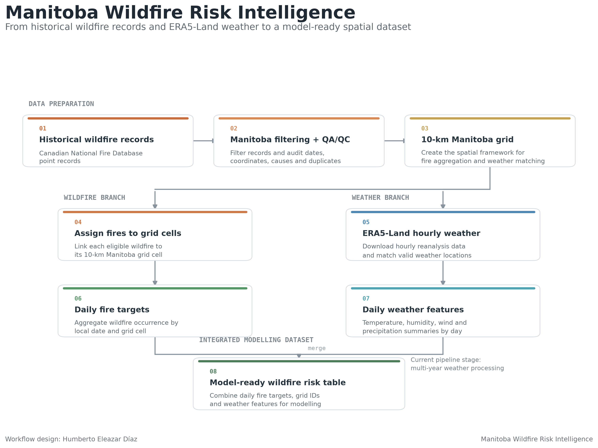
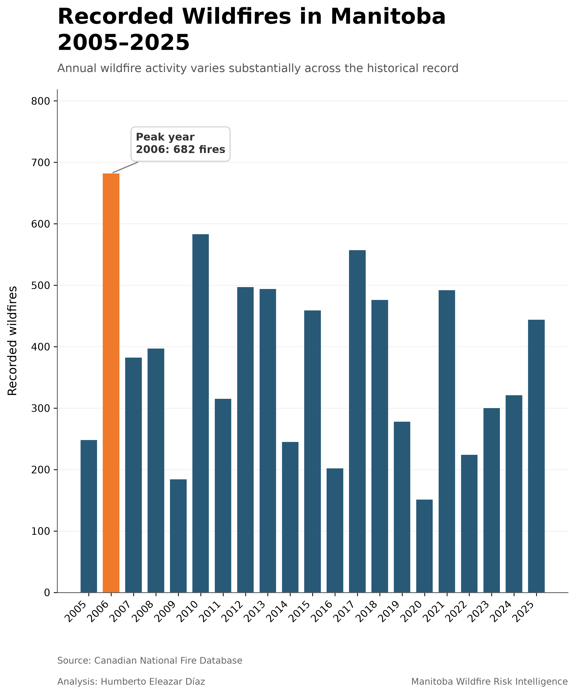
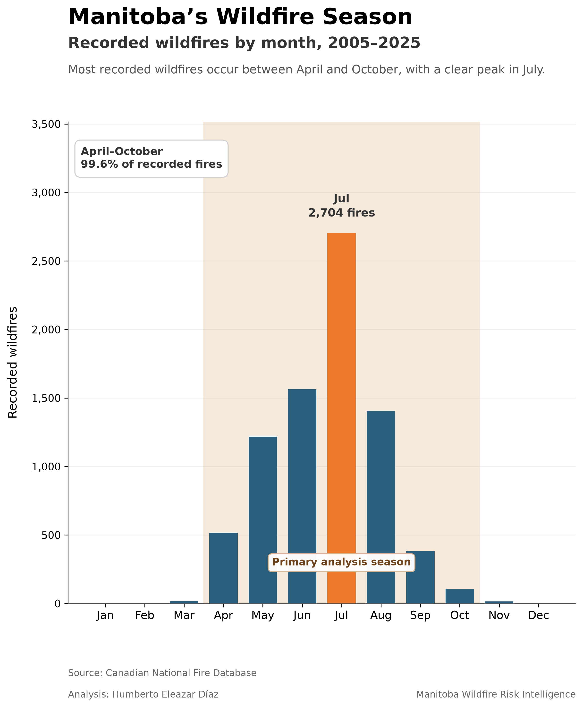
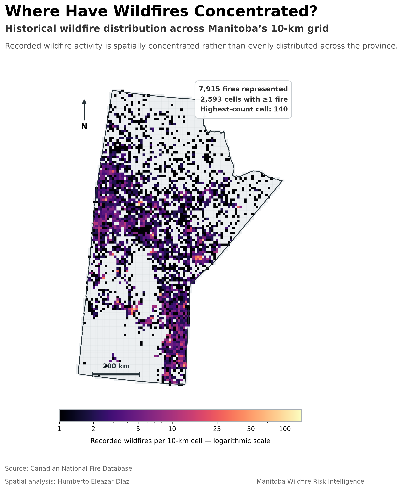
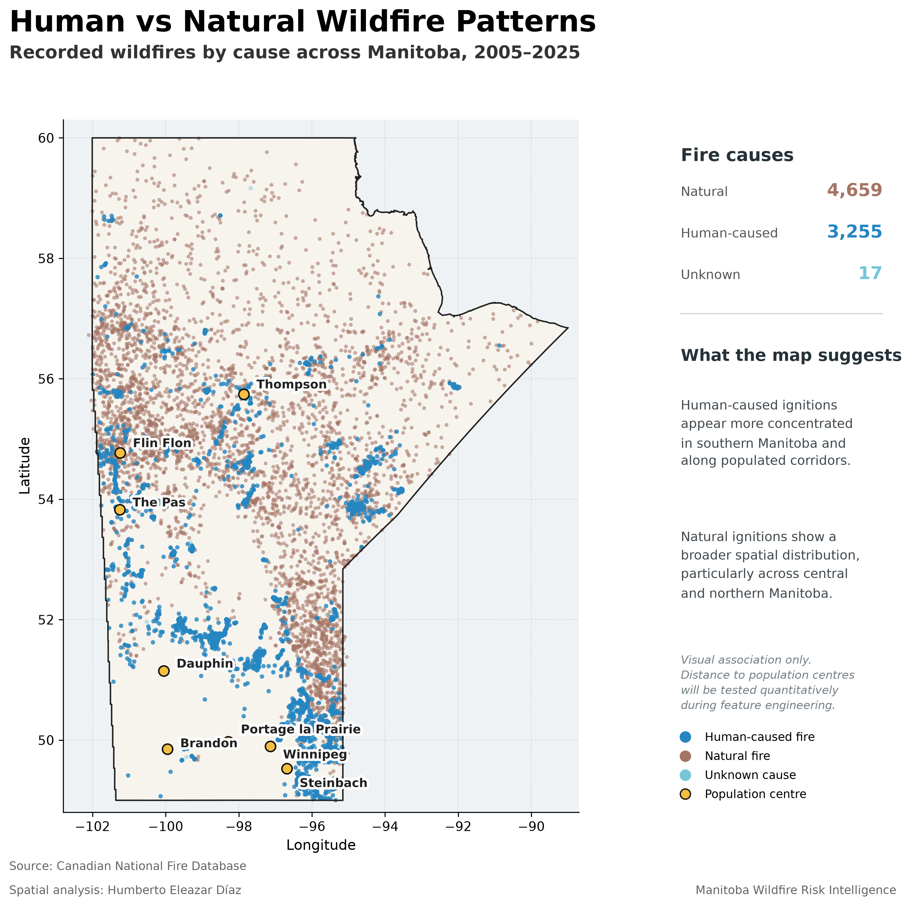
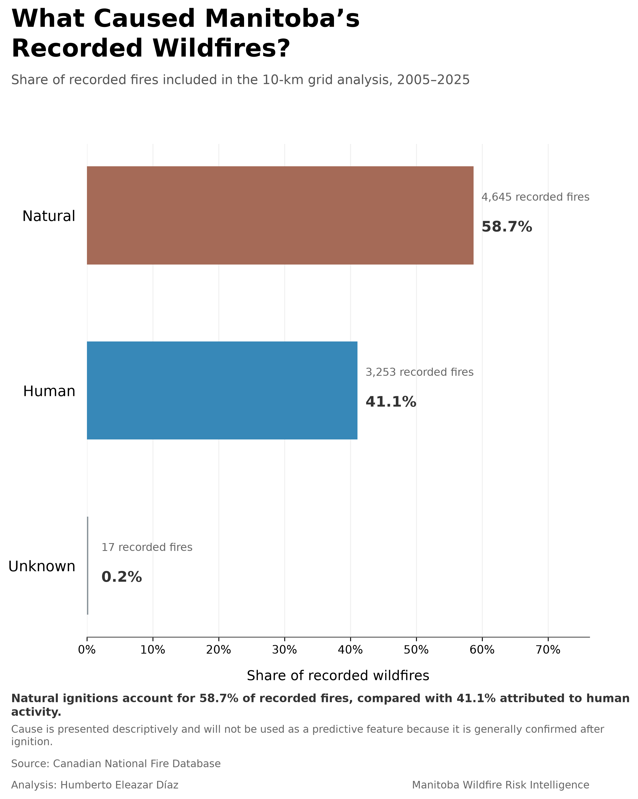

# Manitoba Wildfire Risk Intelligence

**Status:** Active development — validated data pipeline, feature engineering, and historical baselines complete  
**Study area:** Manitoba, Canada  
**Modelling period:** 2005–2025  
**Spatial resolution:** 10 km × 10 km grid cells  
**Forecast horizon:** One day ahead  
**Primary tools:** Python, GeoPandas, Xarray, ERA5-Land, pandas, Scikit-learn

## Project Overview

**Manitoba Wildfire Risk Intelligence** is a geospatial data science and machine-learning project designed to estimate the probability of a new wildfire occurring across Manitoba on the following day.

The project combines historical wildfire records with gridded weather data and is being developed toward a broader explainable risk model that can later incorporate vegetation, terrain, land cover, and human-accessibility variables.

The current pipeline is fully validated from historical fire preprocessing through multi-year ERA5-Land weather processing, next-day feature engineering, chronological model splitting, and two historical-risk baselines.

This is a research and portfolio prototype. It is **not** intended to replace official wildfire monitoring, forecasting, emergency-warning, or fire-danger systems.

## Project Visuals

The figures below summarize the current analytical workflow and key patterns identified in the historical wildfire dataset.

### Project Workflow

<p align="center">
  
</p>

<p align="center">
  <em>
    Workflow from historical wildfire records and ERA5-Land weather
    to a model-ready next-day wildfire-risk dataset.
  </em>
</p>

<br>

### Historical Wildfire Patterns

<table>
  <tr>
    <td width="50%" align="center">
      
    </td>
    <td width="50%" align="center">
      
    </td>
  </tr>
  <tr>
    <td align="center">
      <em>Annual recorded wildfire activity, 2005–2025.</em>
    </td>
    <td align="center">
      <em>Seasonal concentration of recorded wildfires across the year.</em>
    </td>
  </tr>
</table>

<br>

### Spatial Wildfire Patterns

<table>
  <tr>
    <td width="50%" align="center">
      
    </td>
    <td width="50%" align="center">
      
    </td>
  </tr>
  <tr>
    <td align="center">
      <em>Historical wildfire concentration across the 10-km modelling grid.</em>
    </td>
    <td align="center">
      <em>Exploratory comparison of human-caused and natural wildfire patterns.</em>
    </td>
  </tr>
</table>

<br>

### Recorded Fire Causes

<p align="center">
  
</p>

<p align="center">
  <em>
    Fire cause is used for exploratory analysis rather than as a predictive
    feature because cause information is generally identified after ignition.
  </em>
</p>

## Research Question

> Can explainable machine learning estimate next-day wildfire occurrence across Manitoba more effectively than simple historical spatial and seasonal risk baselines?

## Prediction Task

The modelling unit is one **10-km grid cell and forecast day**.

```text
Weather and antecedent conditions through day t
                    ↓
Predict wildfire occurrence on day t + 1
```

The binary target is:

```text
1 = At least one new wildfire occurs in the grid cell on the forecast day
0 = No new wildfire occurs in the grid cell on the forecast day
```

The feature pipeline explicitly separates `PREDICTOR_DATE` from `FORECAST_DATE`, with the forecast date always exactly one day later. This prevents same-day target leakage.

## Current Project Scope

| Component | Current decision |
|---|---|
| Study area | Manitoba, Canada |
| Historical period | 2005–2025 |
| Spatial unit | 10 km × 10 km grid cell |
| Manitoba grid cells | 6,501 |
| Temporal unit | Daily |
| Forecast horizon | One day ahead |
| Modelling season | April 1–October 31 |
| Weather-support period | March 1–October 31 |
| Main task | Rare-event binary classification |
| Training period | 2005–2019 |
| Validation period | 2020–2022 |
| Final test period | 2023–2025 — sealed until final evaluation |
| Primary evaluation focus | PR-AUC, high-risk capture, precision/recall, and calibration |

## Data Sources

### Canadian National Fire Database

Historical wildfire point records are obtained from the Canadian National Fire Database. Relevant fields include fire identifiers, reporting agency, reported date, coordinates, fire size, and cause.

### Manitoba Provincial Boundary

The provincial boundary is used to validate wildfire coordinates, define the study area, create the 10-km analysis grid, and determine which records are eligible for grid-based modelling.

### ERA5-Land

Hourly ERA5-Land reanalysis data are used to construct daily weather features. Downloaded variables include:

- 2-metre air temperature
- 2-metre dew-point temperature
- 10-metre eastward wind component
- 10-metre northward wind component
- Total precipitation

Derived daily variables include:

- Maximum, minimum, and mean temperature
- Minimum and mean relative humidity
- Maximum and mean wind speed
- Total daily precipitation

ERA5-Land timestamps are converted from UTC to Manitoba local time before daily aggregation. Daylight-saving transitions are handled explicitly, so valid 23-hour and 25-hour local days are accepted rather than treated as incomplete.

## End-to-End Workflow

```text
Historical wildfire records
          ↓
Manitoba filtering + QA/QC
          ↓
10-km Manitoba grid
          ↓
   ┌───────────────────────────────┐
   │                               │
Assign fires to grid cells    ERA5-Land hourly weather
   │                               │
Daily fire targets            Daily weather summaries
   │                               │
   └───────────────┬───────────────┘
                   ↓
        Next-day feature engineering
                   ↓
       Chronological model splitting
                   ↓
         Historical-risk baselines
                   ↓
        Weather-based ML modelling
```

## Validated Data Summary

### Historical Fire Records

| Measurement | Result |
|---|---:|
| Manitoba records, 1959–2025 | 28,797 |
| Records with an exact usable date | 25,940 |
| Records without an exact date | 2,857 |
| Records in 2005–2025 before duplicate removal | 7,933 |
| Exact duplicate rows removed | 2 |
| Cleaned 2005–2025 records | 7,931 |
| Records inside the Manitoba modelling boundary | 7,915 |
| Near-border records retained for historical auditing | 16 |
| Zero-size records retained | 153 |

Most records without exact dates occur in earlier years, particularly around 2000–2003. The daily modelling period therefore begins in 2005.

### Fire Causes, 2005–2025

Cause is retained for exploratory analysis but is not used as a predictor of general fire occurrence because it is normally known only after a fire is recorded.

| Cause | Cleaned fire records |
|---|---:|
| Natural | 4,659 |
| Human | 3,255 |
| Unknown | 17 |

### Spatial Grid

| Measurement | Result |
|---|---:|
| Grid size | 10 km × 10 km |
| Cells intersecting Manitoba | 6,501 |
| Cells containing at least one historical fire | 2,593 |
| Maximum historical fires in one cell | 140 |
| Eligible fires assigned to a grid cell | 7,915 |
| Unmatched eligible fires | 0 |

### Daily Fire Targets

Across the complete 2005–2025 daily target table:

| Measurement | Result |
|---|---:|
| Positive grid-cell days | 7,356 |
| Grid-cell days with multiple fires | 434 |
| Maximum fires in one cell on one day | 10 |
| Duplicate date-grid combinations | 0 |

For the April–October modelling season specifically, the final next-day feature dataset contains **7,324 positive grid-cell targets representing 7,882 individual fires**.

## ERA5-Land Processing and Validation

Each annual weather-support table covers **March 1–October 31** so that rolling weather features are already available for April 1 forecasts.

For every year from 2005 through 2025:

- 245 weather-support dates
- 6,501 grid cells
- 1,592,745 grid-cell weather rows
- 0 missing final weather features
- 0 duplicate date-grid combinations

The full 21-year multi-year audit passed:

| Audit result | Value |
|---|---:|
| Years expected | 21 |
| Years passed | 21 |
| Years failed | 0 |
| April–October individual fires represented | 7,882 |

Some coastal, lake-adjacent, or water-dominated grid cells do not have a valid ERA5-Land value at the nearest nominal grid location. These cells are matched to the nearest valid ERA5-Land land point. The maximum validated match distance is **35.03 km**, and match-distance information is retained for quality control.

## Feature Engineering

Weather through day **t** is used to predict fire occurrence on day **t + 1**.

Current predictors include the daily weather conditions plus:

### Antecedent precipitation

- `PRECIP_3D_MM`
- `PRECIP_7D_MM`
- `PRECIP_30D_MM`

### Recent temperature

- `TEMP_MAX_3D_MEAN_C`
- `TEMP_MAX_7D_MEAN_C`

### Recent humidity

- `RH_MIN_3D_MEAN_PCT`
- `RH_MIN_7D_MEAN_PCT`

### Recent wind

- `WIND_MAX_3D_MEAN_MS`
- `WIND_MAX_7D_MEAN_MS`

### Dryness and seasonality

- `DAYS_SINCE_RAIN` using a 1 mm daily precipitation threshold
- `DAY_OF_YEAR`
- `DOY_SIN`
- `DOY_COS`

March weather is retained as support data so that 30-day features are available for forecasts beginning April 1.

## Final Feature Dataset

All 21 annual feature tables passed validation.

| Measurement | Result |
|---|---:|
| Years | 21 |
| Rows | 29,215,494 |
| Grid cells | 6,501 |
| Forecast days per year | 214 |
| Positive next-day grid-cell targets | 7,324 |
| Individual fires represented | 7,882 |
| Missing engineered feature values | 0 |
| Duplicate forecast-date/grid rows | 0 |

The overall positive-target prevalence is approximately **0.025%**, making this an extremely imbalanced rare-event classification problem.

## Chronological Model Design

Random row splitting is avoided because nearby grid cells and neighboring dates can be strongly correlated. The project instead uses a chronological split designed to simulate prediction into future fire seasons.

| Split | Years | Rows | Positive targets | Purpose |
|---|---:|---:|---:|---|
| Train | 2005–2019 | 20,868,210 | 5,500 | Learn model parameters |
| Validation | 2020–2022 | 4,173,642 | 822 | Compare models and tune decisions |
| Test | 2023–2025 | 4,173,642 | 1,002 | Final untouched evaluation |

The **2023–2025 test period has not been used** to choose features, tune thresholds, or compare model variants.

## Baseline Results

Two non-weather historical baselines have been evaluated on the 2020–2022 validation period.

### 1. Historical Spatial-Risk Baseline

Each grid cell receives a score based only on its wildfire frequency during 2005–2019.

| Metric | Result |
|---|---:|
| Validation prevalence | 0.019695% |
| PR-AUC / Average Precision | 0.001118 |
| Random PR baseline | 0.000197 |
| Lift over random | 5.67× |
| ROC-AUC | 0.752907 |
| Top 1% fire capture | 12.90% |
| Top 5% fire capture | 31.87% |
| Top 10% fire capture | 46.72% |

### 2. Historical Spatial + Seasonal Baseline

This baseline learns wildfire frequency by **grid cell × calendar month** from 2005–2019 and applies empirical-Bayes smoothing toward the historical monthly rate.

| Metric | Result |
|---|---:|
| Validation prevalence | 0.019695% |
| PR-AUC / Average Precision | 0.001446 |
| Random PR baseline | 0.000197 |
| Lift over random | 7.34× |
| ROC-AUC | 0.796183 |
| Top 1% fire capture | 13.50% |
| Top 5% fire capture | 32.48% |
| Top 10% fire capture | 49.27% |

Adding seasonality improved validation PR-AUC by **29.38%** relative to the spatial-only baseline.

These benchmarks establish that historical **location** and **time of season** already contain meaningful predictive information. Weather-based models must improve on these baselines to demonstrate added value.

## Evaluation Strategy

Ordinary accuracy is not treated as a primary metric. With a positive prevalence near 0.025%, an almost-always-negative classifier could appear highly accurate while providing little operational value.

Primary evaluation focuses on:

- Precision-recall area under the curve / Average Precision
- Fire capture within the highest-risk fraction of grid-days
- Precision and recall
- Probability calibration and Brier score
- Threshold-specific confusion matrices
- False-alarm burden
- Temporal generalization into future years

ROC-AUC is retained as a secondary ranking metric.

## Current Progress

### Completed

- [x] Canadian National Fire Database ingestion and QA/QC
- [x] Manitoba filtering and boundary validation
- [x] 10-km grid creation and wildfire assignment
- [x] Daily fire target construction
- [x] ERA5-Land pilot and nearest-valid-land matching
- [x] Full 2005–2025 ERA5-Land download automation
- [x] Manitoba-local daily weather aggregation
- [x] Daylight-saving-aware validation
- [x] Multi-year weather and model-table audit — 21/21 years passed
- [x] Next-day feature engineering
- [x] 3-, 7-, and 30-day rolling precipitation features
- [x] Recent temperature, humidity, and wind features
- [x] Consecutive dry-day feature
- [x] Seasonal sine/cosine features
- [x] Feature-table audit — 21/21 years passed
- [x] Chronological train/validation/test split
- [x] Historical spatial-risk baseline
- [x] Historical spatial + seasonal baseline
- [x] Project visualization notebook

### Current Modelling Stage

- [ ] Weather-only logistic regression

### Planned

- [ ] Compare additional nonlinear models
- [ ] Tune validation thresholds and inspect calibration
- [ ] Add vegetation and land-cover features
- [ ] Add terrain features
- [ ] Add human-accessibility variables
- [ ] Evaluate geographic generalization
- [ ] Add explainability using SHAP or comparable methods
- [ ] Evaluate the sealed 2023–2025 test period only after model selection
- [ ] Build an interactive wildfire-risk prototype/dashboard

## Repository Structure

```text
manitoba-wildfire-risk-intelligence/
│
├── README.md
├── requirements.txt
├── .gitignore
│
├── data/
│   ├── raw/
│   ├── interim/
│   └── processed/
│       └── features/
│
├── docs/
│   └── project_documentation.md
│
├── notebooks/
│   ├── 01_fire_data_exploration.ipynb
│   ├── 02_manitoba_grid.ipynb
│   ├── 03_daily_fire_targets.ipynb
│   ├── 04_era5_weather_pilot.ipynb
│   ├── 05_era5_weather_july_2024.ipynb
│   ├── 06_era5_weather_2024_fire_season.ipynb
│   └── 07_linkedin_visuals.ipynb
│
├── scripts/
│   ├── run_era5_batch.sh
│   └── run_feature_batch.sh
│
├── src/
│   ├── data/
│   │   ├── download_era5_fire_season.py
│   │   ├── process_era5_fire_season.py
│   │   └── audit_multiyear_outputs.py
│   ├── features/
│   │   ├── build_weather_features.py
│   │   └── audit_feature_outputs.py
│   ├── models/
│   │   ├── create_split_manifest.py
│   │   ├── evaluate_spatial_baseline.py
│   │   └── evaluate_spatiotemporal_baseline.py
│   └── visualization/
│
├── models/
├── outputs/
│   ├── figures/
│   ├── logs/
│   ├── maps/
│   └── tables/
│
└── app/
```

## Reproducibility

Clone the repository:

```bash
git clone https://github.com/DiazHumberto/manitoba-wildfire-risk-intelligence.git
cd manitoba-wildfire-risk-intelligence
```

Create and activate a virtual environment:

```bash
python3 -m venv venv
source venv/bin/activate
```

Install dependencies:

```bash
python -m pip install --upgrade pip
pip install -r requirements.txt
```

Large raw, interim, and processed datasets are not committed to GitHub. Reproducing the complete weather pipeline requires access to the original data providers and a configured Copernicus Climate Data Store account. API credentials are never stored in the repository.

The detailed processing history, validation checks, design decisions, and generated outputs are documented in [`docs/project_documentation.md`](docs/project_documentation.md).

## Limitations

Current limitations include:

- Historical fire reporting practices vary by year and agency.
- Exact dates are unavailable for some older records.
- Some fire coordinates may represent approximate reporting locations.
- Sixteen Manitoba-reported 2005–2025 records fall slightly outside the official modelling boundary and are retained only for historical auditing.
- ERA5-Land is coarser than local station observations.
- Water-adjacent cells may rely on a more distant valid ERA5-Land land point.
- The current engineered feature set is weather- and seasonality-focused; vegetation, terrain, lightning, and accessibility variables have not yet been integrated.
- Historical fire occurrence is extremely imbalanced across space and time.
- Fire records represent reported fires, not necessarily every ignition.
- Historical spatial patterns can encode reporting, access, suppression, and settlement effects in addition to physical wildfire susceptibility.
- The project has validated baselines but has not yet selected a final predictive model.

## Responsible Use

This project is an educational, research, and portfolio prototype.

It must not be used as:

- An official wildfire forecast
- An emergency-warning system
- A replacement for government fire-danger products
- A basis for operational deployment without independent validation
- A substitute for expert wildfire-management decisions

Official wildfire information and emergency instructions should always be obtained from the appropriate federal, provincial, and local authorities.

## Author

**Humberto Eleazar Díaz Maridueña**

Environmental professional with a Bachelor of Environmental Engineering and a Post-Degree Diploma in Artificial Intelligence and Machine Learning.

Based in Winnipeg, Manitoba, Canada.

- Portfolio: https://diazhumberto.github.io/
- GitHub: https://github.com/DiazHumberto
- LinkedIn: https://www.linkedin.com/in/humberto-e-diaz

## Project Status

The current modelling checkpoint is complete through **historical spatial and spatial-seasonal validation baselines**. The next model is a weather-only logistic regression, followed by progressively more flexible models and additional environmental/spatial predictors.

The final 2023–2025 test period remains untouched until model selection is complete.
